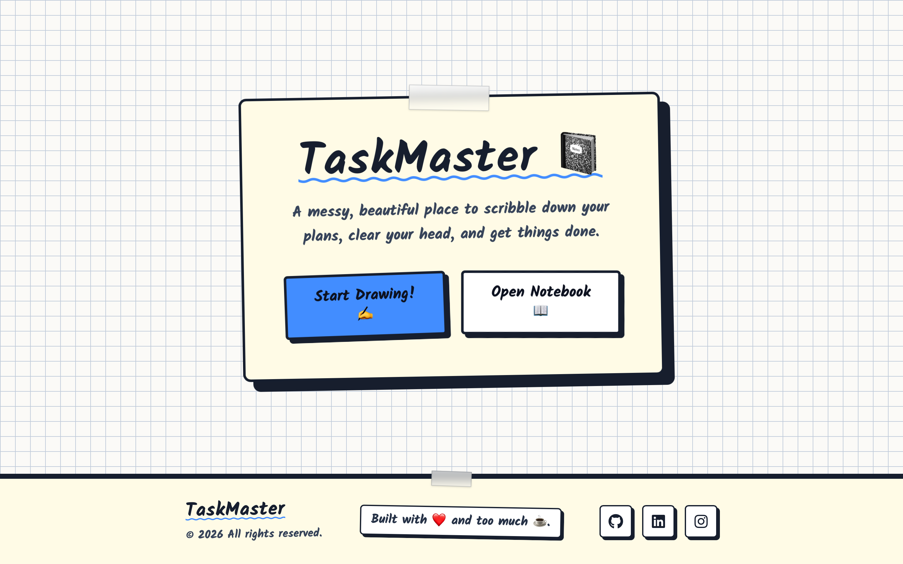
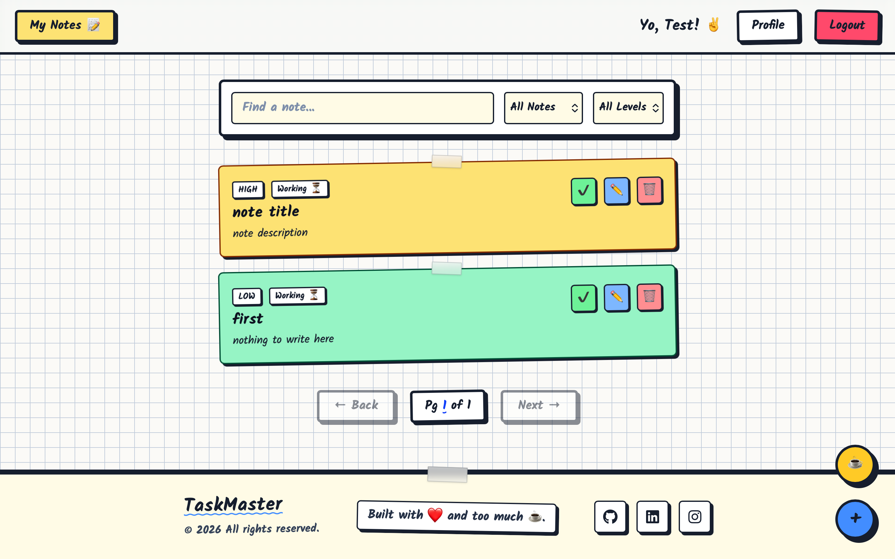
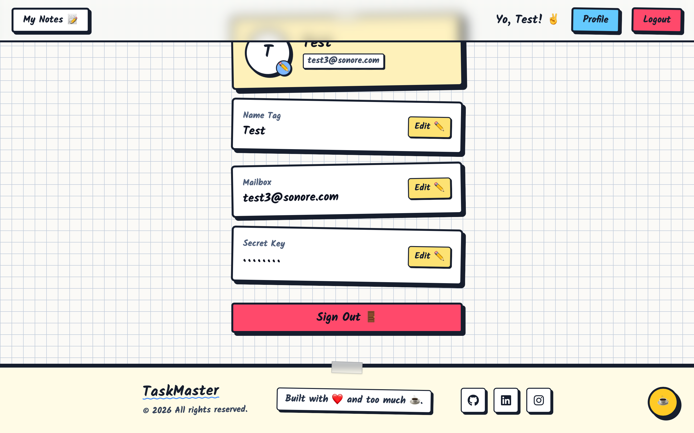
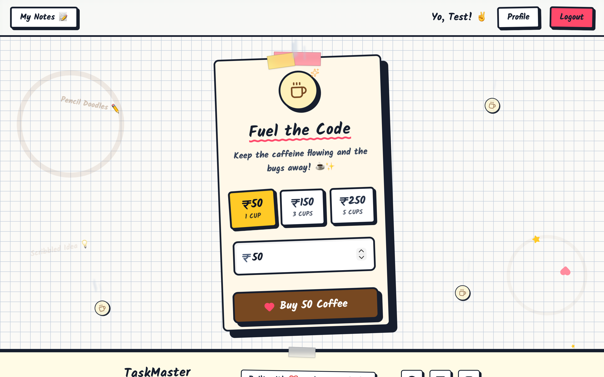

# TaskSketch 📓☕


**TaskSketch** is a full-stack, beautifully hand-drawn to-do and productivity application. Moving away from sterile corporate UI, TaskSketch features a highly interactive "Sketchbook Cafe" aesthetic, complete with math-grid notebook pages, masking tape UI elements, brutalist marker borders, and floating 3D parallax elements.

🔗 **Live Application:** [https://tasksketch.rohangautam.app/](https://tasksketch.rohangautam.app/)
## Home

## Dashboard

## Profile

## Buy-me-a-coffee

---

## ✨ Features

* **🎨 "Artist's Sketchbook" UI:** A completely custom interface using a pure CSS math-grid background, the `Kalam` handwriting font, and skeuomorphic elements like masking tape and physical stickers.
* **🔐 Secure Authentication:** Full JWT-based login and registration system protecting user notes and data.
* **📓 Dashboard & Notes:** A personalized space to scribble down your plans, clear your head, and get things done.
* **👤 Profile Management:** Users can update their "Name Tag", "Mailbox" (email) and "Secret Key" (password).
* **☕ "Fuel the Code" Portal:** A custom 3D parallax donation page integrating **Razorpay**. Features floating cafe doodles, steaming coffee mugs, and animated interactive elements.
* **📱 Fully Responsive:** Carefully crafted with Tailwind CSS to look incredible on desktops, tablets, and mobile devices.

---

## 🛠️ Tech Stack

**Frontend Framework & Libraries:**
* **[React](https://reactjs.org/) & [Vite](https://vitejs.dev/):** Lightning-fast development and optimized production builds.
* **[TypeScript](https://www.typescriptlang.org/):** For robust, strictly-typed code.
* **[Tailwind CSS](https://tailwindcss.com/):** For complex, highly-customized styling and grid backgrounds.
* **[Framer Motion](https://www.framer.com/motion/):** Powering the complex 3D tilt cards, floating background elements, and page transitions.
* **[Axios](https://axios-http.com/):** For secure API communication with interceptors.
* **[React Router DOM](https://reactrouter.com/):** For protected routing and navigation.

**Backend (Separate Repository):**
* **Spring Boot (Java)**
* **PostgreSQL**
* **Razorpay SDK**
* *Link to backend repo: [TO-DO-with-SPRING](https://github.com/Rohan-Gautam/TO-DO-with-SPRING/)*

---

## 🚀 Running Locally

To get a local copy up and running, follow these simple steps.

### 1. Clone the repository
```bash
git clone [https://github.com/Rohan-Gautam/todo-frontend.git](https://github.com/Rohan-Gautam/todo-frontend.git)
cd todo-frontend

```

### 2. Install dependencies

```bash
npm install
# or
yarn install

```

### 3. Setup Environment Variables

Create a `.env` file in the root directory. You will need to connect this to your local backend and your Razorpay testing account.

```env
# The URL where your Spring Boot backend is running
VITE_API_BASE_URL=http://localhost:8080

# Your PUBLIC Razorpay Key ID (Safe to expose)
VITE_RAZORPAY_KEY_ID=rzp_test_your_public_key_here

```

### 4. Start the development server

```bash
npm run dev
# or
yarn dev

```

Open [http://localhost:5173](https://www.google.com/search?q=http://localhost:5173) in your browser to view the app.

---

## 📂 Folder Structure

```text
src/
├── api/            # Axios setup and interceptors
├── components/     # Reusable UI components (Navbar, Footer, ProtectedRoutes)
├── pages/          # Main application views (Home, Login, Dashboard, Coffee, etc.)
├── App.tsx         # Route configurations
└── main.tsx        # React DOM entry point

```

---

## 👨‍💻 Author

Built with ❤️ and way too much ☕ by **Rohan Gautam**.

* **GitHub:** [@Rohan-Gautam](https://github.com/Rohan-Gautam)
* **LinkedIn:** [@Rohan-Gautam](https://www.linkedin.com/in/rohan-gautam-b33695250/)

If you like this project, consider giving it a ⭐!

```

```